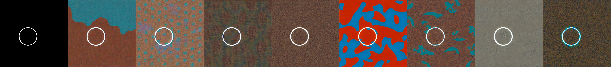

---
license: creativeml-openrail-m
base_model: runwayml/stable-diffusion-v1-5
tags:
- stable-diffusion
- stable-diffusion-diffusers
- text-to-image
- diffusers
- controlnet
- jax-diffusers-event
inference: true
---
    
# controlnet- 1234

These are controlnet weights trained on runwayml/stable-diffusion-v1-5 with new type of conditioning. You can find some example images in the following. 

prompt: 

prompt: muted colors

prompt: dreamy colors

